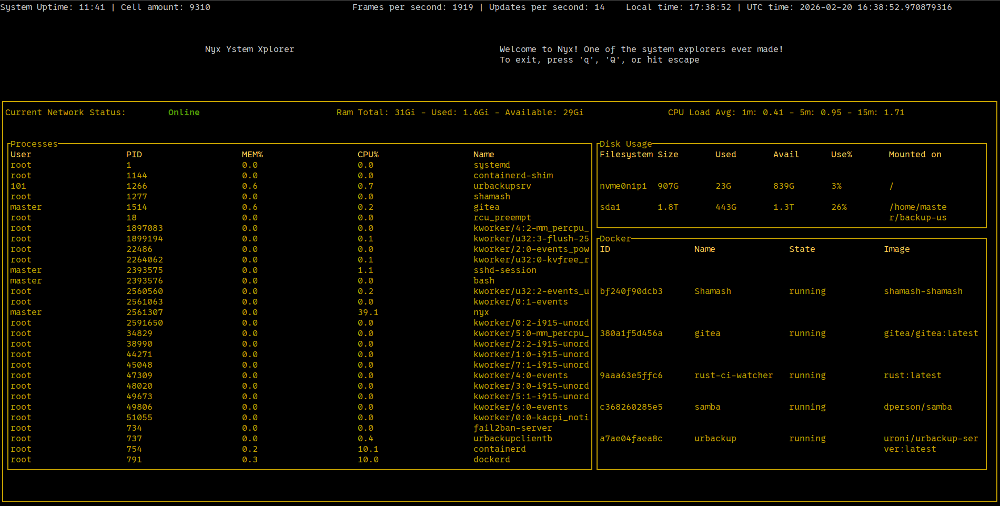

# nyx: Nyx Ystem Xplorer

Nyx is a real-time system monitor written in Rust, designed with a modular architecture that separates data collection from the user interface. It provides comprehensive monitoring of CPU usage, memory consumption, disk I/O, network traffic, and Docker containers.

Nyx truly is, one of the sYstem eXplorer's ever made!

## Visuals




## Architecture & Features

Version 3 introduces a complete rework of the project to ensure high performance and reliability:

- **Multi-Process Design:** Split into `nyx-backend` and `nyx-tui`, orchestrated by `nyx-builder`.
- **High Performance:** Targetting 60 FPS for the TUI, with the backend handling data collection independently.
- **IPC Framework:** Uses [hermes](https://github.com/xqhare/hermes) for efficient multi-process communication.
- **Ecosystem Integration:** Built using the Xqhare toolbox, including [athena](https://github.com/xqhare/athena), [horae](https://github.com/xqhare/horae), and [talos](https://github.com/xqhare/talos).
- **Real-time Monitoring:**
    - **Memory:** Precise tracking using `free -h`.
    - **Disk usage:** Comprehensive view via `df -h`.
    - **Docker Integration:** Real-time status of containers using `docker ps -a`.
    - **Network Status:** Integration with `shamash` for ISP and local outage monitoring.
    - **Process Management:** Top 15 CPU-consuming processes.
    - **System Uptime:** Uptime and load averages (1, 5, 15 minutes).
- **Meta-Metrics:** Includes an FPS counter and backend update time tracking.

## Requirements

Nyx works best on **Linux** and has the following recommendations:

- **[shamash](https://github.com/Xqhare/shamash):** Installed and configured for network status monitoring.
- **Docker:** Installed, with the executing user added to the `docker` group to allow monitoring without `sudo`.

## Building and Running

Since this is a Rust workspace, you can build and run it using `cargo`:

### Build all members
```bash
cargo build --release
```

### Run the application
```bash
cargo run -p nyx-builder
```

## Testing

To run tests for the different components, use the following commands:

```bash
# Test the backend
cargo test -p nyx-backend

# Test the TUI
cargo test -p nyx-tui
```

## Naming

Nyx was the ancient Greek goddess of the night, one of the primordial gods (protogenoi) who emerged as the dawn of creation.

## License

This project is licensed under the MIT License - see the [LICENSE](LICENSE) file for details.
